# EXNO2DS
# AIM:
      To perform Exploratory Data Analysis on the given data set.
      
# EXPLANATION:
  The primary aim with exploratory analysis is to examine the data for distribution, outliers and anomalies to direct specific testing of your hypothesis.
  
# ALGORITHM:
STEP 1: Import the required packages to perform Data Cleansing,Removing Outliers and Exploratory Data Analysis.

STEP 2: Replace the null value using any one of the method from mode,median and mean based on the dataset available.

STEP 3: Use boxplot method to analyze the outliers of the given dataset.

STEP 4: Remove the outliers using Inter Quantile Range method.

STEP 5: Use Countplot method to analyze in a graphical method for categorical data.

STEP 6: Use displot method to represent the univariate distribution of data.

STEP 7: Use cross tabulation method to quantitatively analyze the relationship between multiple variables.

STEP 8: Use heatmap method of representation to show relationships between two variables, one plotted on each axis.

## CODING AND OUTPUT
```
  import pandas as pd
df=pd.read_csv("C:/Users/acer/Downloads/titanic_dataset.csv")
print(df)
```
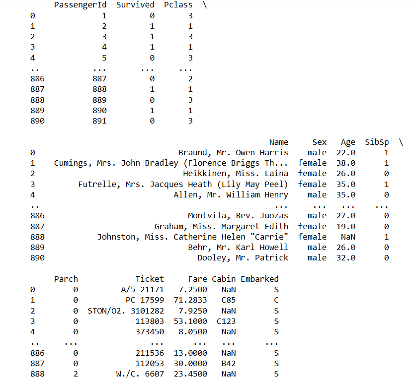
```
df.info()
```
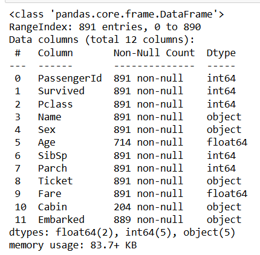
```
df.describe()
```
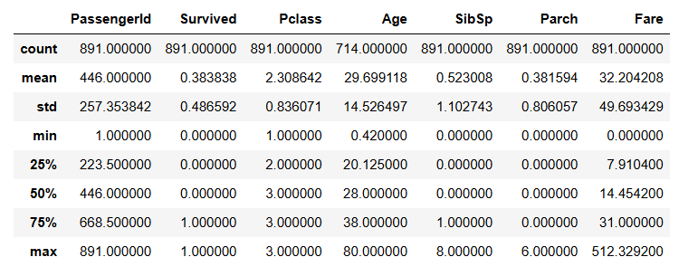
```
df.shape
```
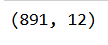
```
df.dtypes
```
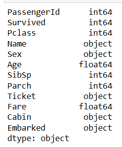
```
df["Survived"].value_counts()
```
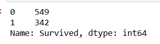
```
df.nunique()
```
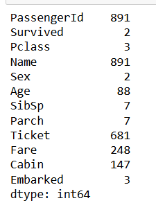
```
import seaborn as sns
sns.countplot(data=df,x="Survived")
```
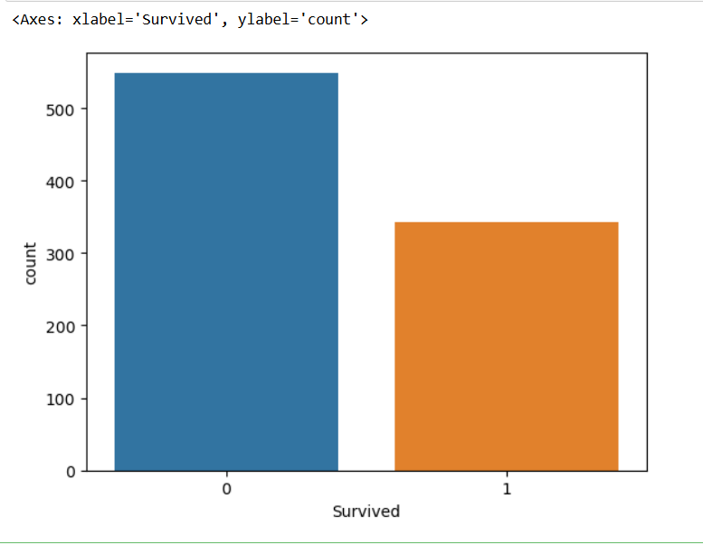
```
sns.boxplot(data=df,x="Survived")
```
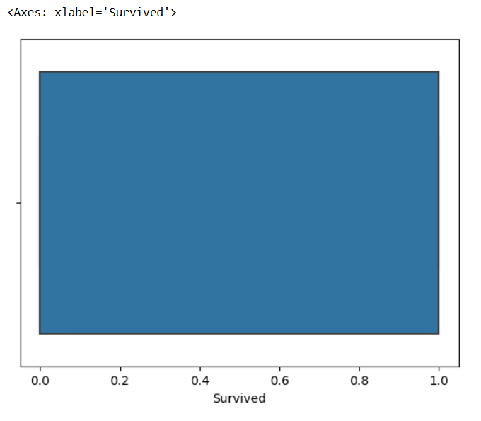
```
sns.boxplot(data=df,x="Age")
```
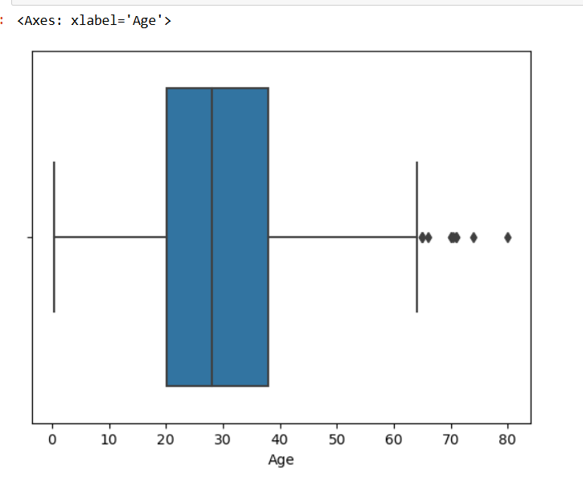
```
sns.histplot(data=df,x="Age")
```
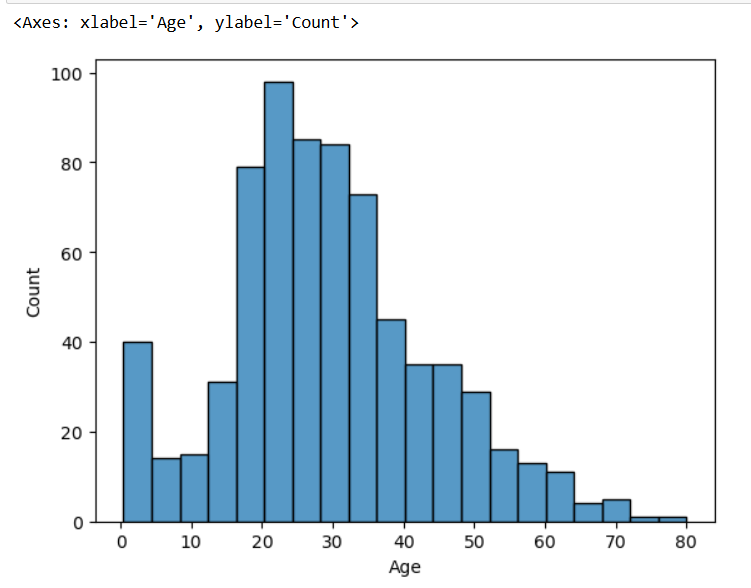
```
df.rename(columns={'Sex' : 'Gender'},inplace=True)
print(df)
```
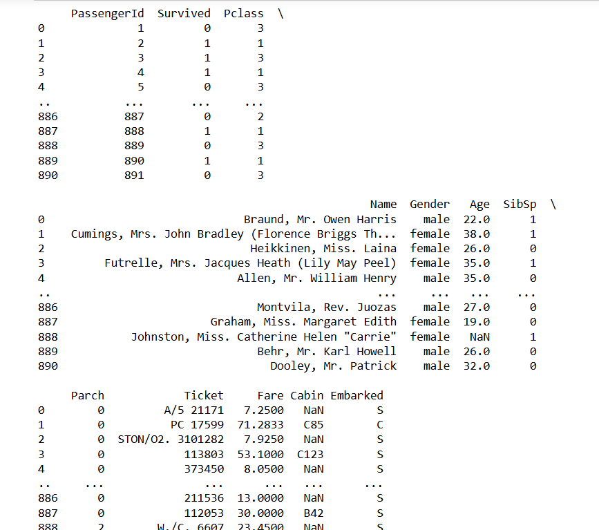
```
sns.catplot(x='Survived',hue="Gender",data=df,kind='count')
```
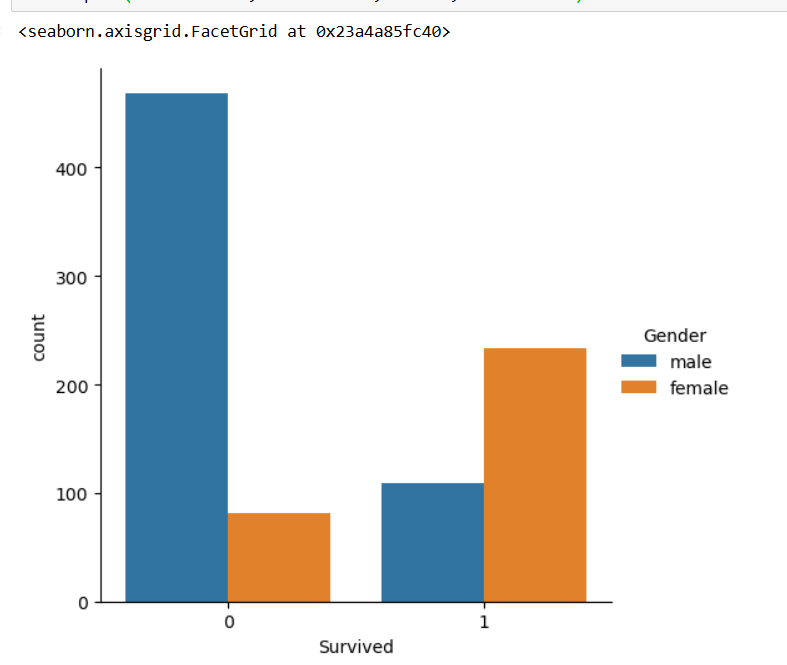
```
df.boxplot(column="Age",by="Survived")
```
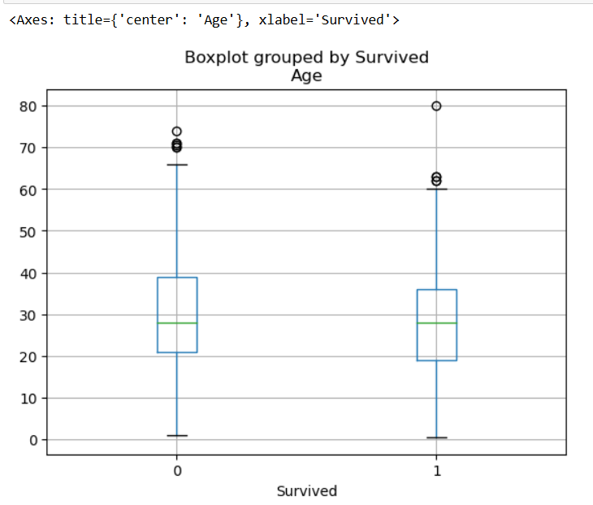
```
sns.scatterplot(x=df["Age"],y=df["Fare"])
```
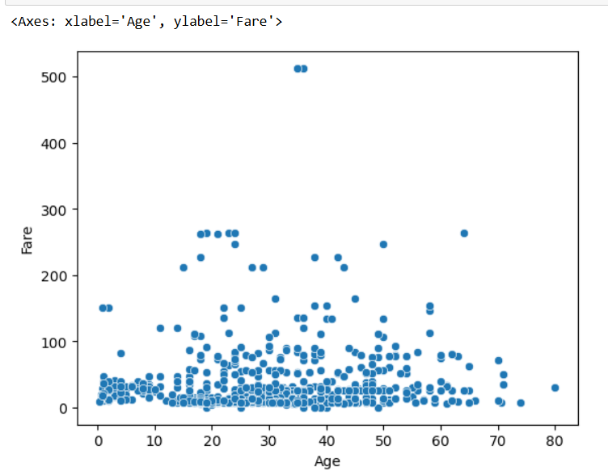
```
sns.boxplot(x=df["Age"],y=df["Fare"])
```
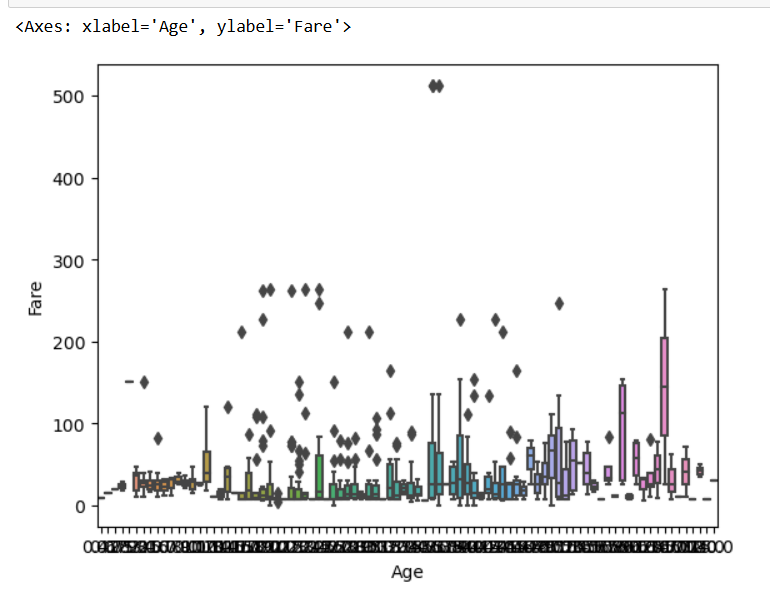
```
sns.barplot(x=df["Age"],y=df["Fare"])
```
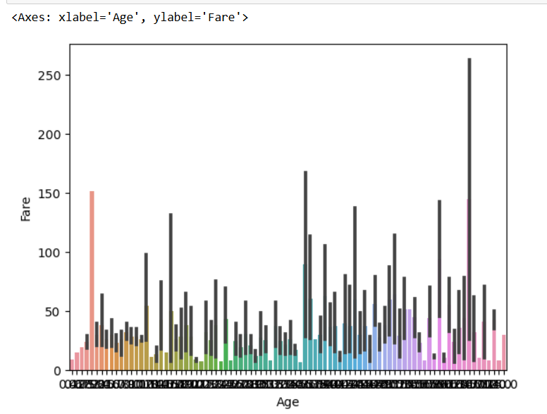
```
sns.barplot(x=df["Survived"],y=df["Fare"])
```
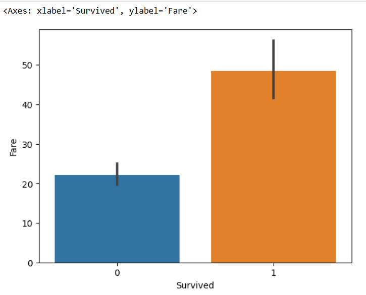
```
sns.boxplot(x="Pclass",y="Age",hue="Gender",data=df)
```
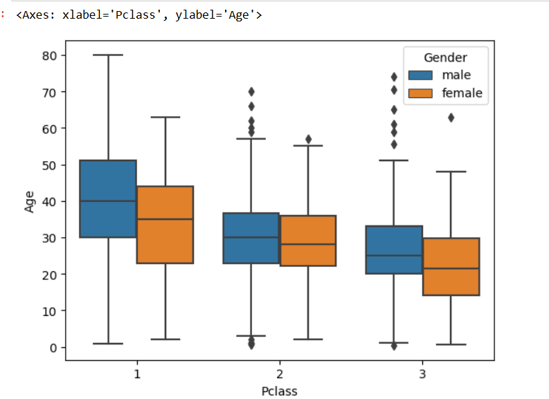
```
sns.catplot(col='Survived',x="Gender",hue="Pclass",data=df,kind='count')
```
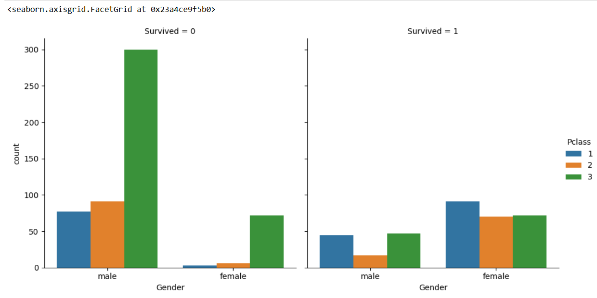
```
sns.heatmap(df.corr())
```
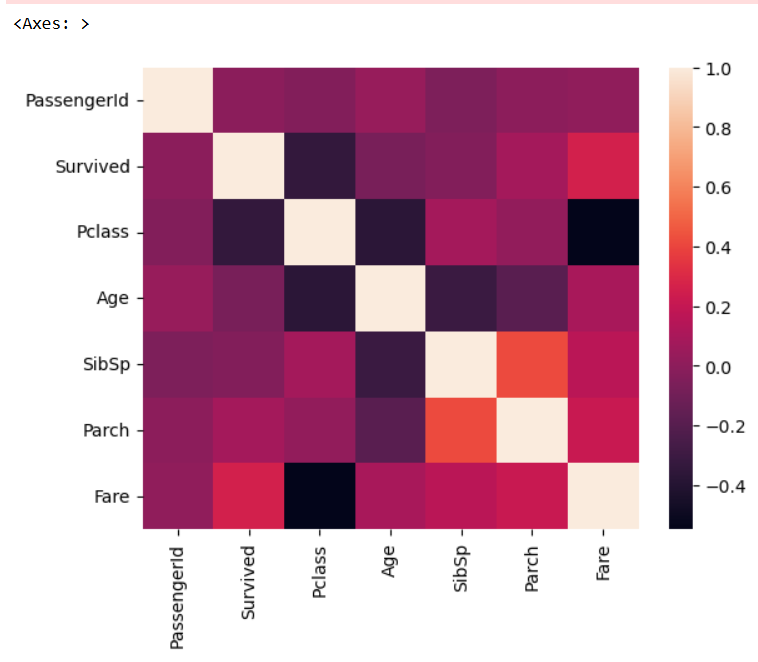
```
sns.heatmap(df.corr(),annot=True)
```
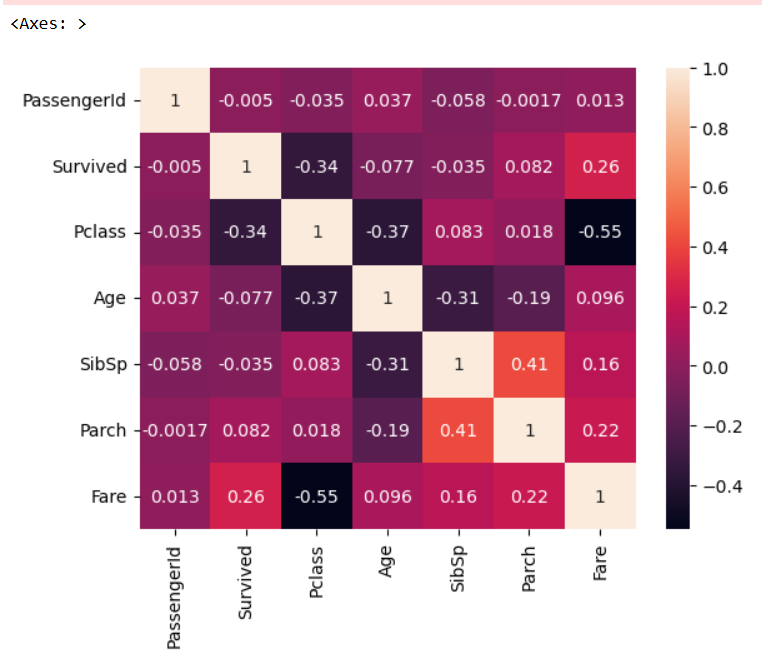

# RESULT
          Data analysis was completed successfully
